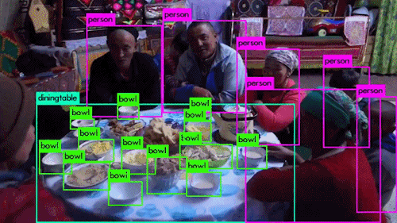

# Object Detection using Darknet & YOLO

<!-- vscode-markdown-toc -->
* [Overview](#overview)
* [Object Detection](#objectdetection)
     * [Dataset](#Dataset)
     * [Model Training](#modeltraining)
     * [Workflow Implementation](#workflowimplementation)

<!-- vscode-markdown-toc-config
	numbering=false
	autoSave=true
	/vscode-markdown-toc-config -->
<!-- /vscode-markdown-toc -->

## **Overview**

 Object detection is a computer vision technique that allows us to identify and locate objects in an image or video. With this kind of recognition, object detection helps in counting objects in a scene and determine and track their precise locations, all while accurately labeling them.
	       

## **Object Detection**

### ***Dataset***

Dataset that is used is one of the popular which is [PASCAL VOC Dataset (PASCAL Visual Object Classes)](https://pjreddie.com/projects/pascal-voc-dataset-mirror/). It is used for image classification, object detection & segmentation. 

It can recognize objects from about 20 object classes (such as person, bird, cat, dining table, bus, etc.)

### ***Model Training***

Model is trained with a set of 16551 annotated images from the PASCAL VOC Dataset.

[Darknet](https://pjreddie.com/darknet/) which is an open-sourced neural network framework is used for real-time object detection. It is fast as it is written in CUDA & C. [YOLO (You Only Look Once)](https://pjreddie.com/darknet/yolo/) which is a state-of-the-art real-time object detection algorithm is implemented for model training.

### ***Workflow Implementation***

Object detection workflow is implemented on [Kubeflow](https://www.kubeflow.org/) as follows:

* [Kubeflow Pipeline](./pipeline/)

