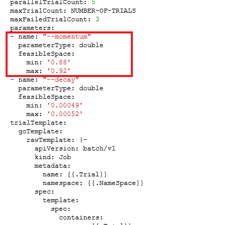
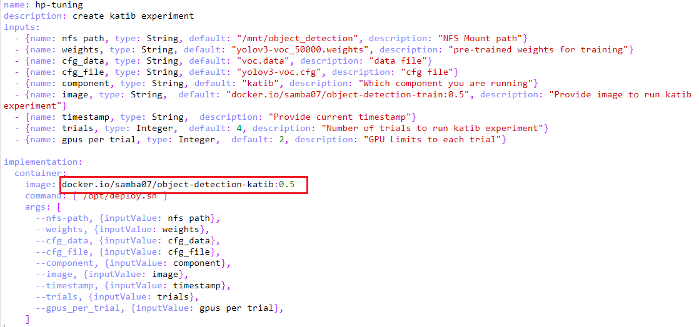
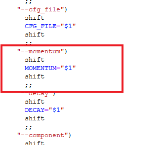
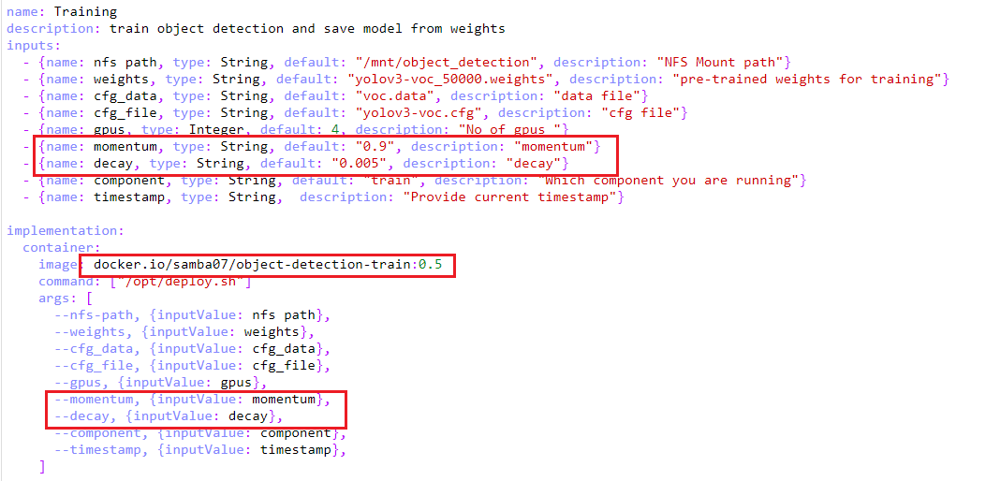

# **Custom HP tuning with Katib for Object Detection Pipeline**

## <a name='Introduction'></a>**Introduction**

Currently, Katib Hyperparameter tuning (HP) for object detection pipeline is done considering two parameters:

* Momentum
* Decay

Additional hyperparameters and the number of hyperparameters to be tuned can be added as per procedure below. 

## <a name='Procedure'></a>**Custom HP Tuning Procedure**

- Open Katib component deployment shell script named ```deploy.sh``` present in folder of [Katib src](./components/v2/katib/src).

- Add the part of YAML configuration required for the new desired hyperparameter under ```parameters:``` tag similar to the existing as shown below:



- Build Docker image for [Katib component](./components/v2/katib) & provide the resulting image name under ```image``` in ```component.yaml``` in the location as shown below.



- Open Train component deployment shell script named ```deploy.sh``` present in folder of [Train src](./components/v2/train/src).

- Declare the desired hyperparameters under ```do while``` cases in the same file as shown.



- Open ```component.yaml``` of [Train component](./components/v2/train), and add the required configuration as shown below under ```inputs:``` tag & the ```args:``` tag under ```implementation:``` tag.



- Build Docker image for [Train component](./components/v2/train) & provide the resulting image name under ```image``` in ```component.yaml``` in the location as shown above.

Katib component with customized HP tuning is ready to be used in object detection pipeline.
