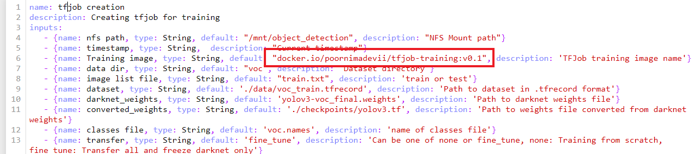
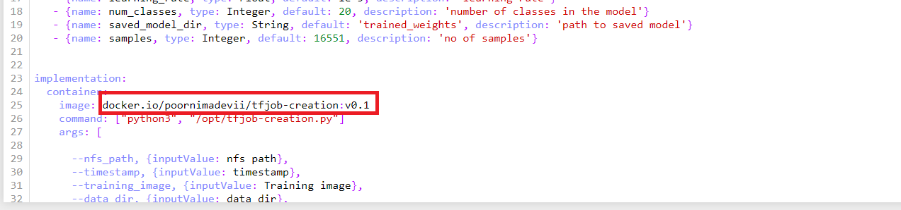

# **Image building for training component using TFJob**

## **Introduction**

This component involves building two images to be used with Kubeflow pipeline.

* An image for actual model training using TFjob - [TFjob training](./components/v2/tfjob/tfjob-train)
* An image for TFJob launching - [TFjob creation](./components/v2/tfjob)

## **Procedure to build images**

- To build image for model TFjob training, move the [TFjob training](./components/v2/tfjob/tfjob-train) directory out of [TFjob component](./components/v2/tfjob). Use the moved [TFjob training](./components/v2/tfjob/tfjob-train) to build your docker training image.

- Specify the built image name of the training image in the [component.yaml](./components/v2/tfjob/component.yaml) as shown below.

- To build image for TFJob launcher, now use the [TFjob component](./components/v2/tfjob) to build TFJob launching image.

- Specify the built image name of TFjob launching image in the [component.yaml](./components/v2/tfjob/component.yaml) as shown below.

**NOTE :**

Default images that are already specified for training and TFJob launching in the [component.yaml](./components/v2/tfjob/component.yaml) can be used for pipeline execution.
