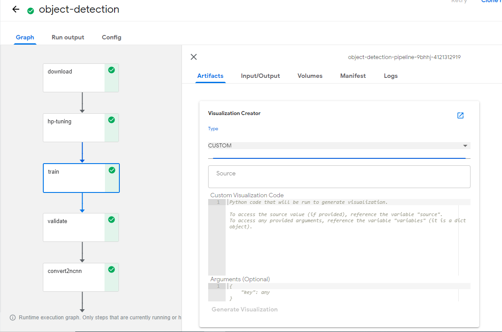
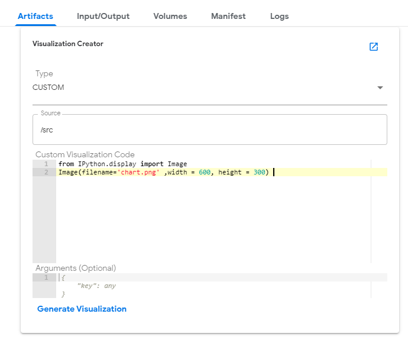
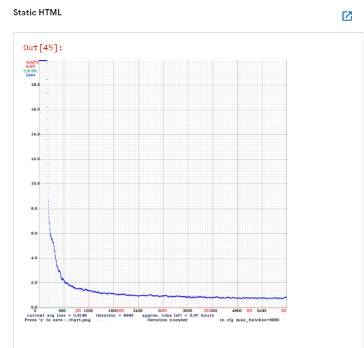

# Python based visualizations for object detection Kubeflow pipeline
Python based visualizations are a new method of generating visualizations within Kubeflow Pipelines that allow for rapid development, experimentation, and customization when visualizing results. Python based visualizations provide two categories of visualizations. The first being **predefined visualizations**. These visualizations are provided by default in Kubeflow Pipelines and serve as a way for you and your customers to easily and quickly generate powerful visualizations. The second category is **custom visualizations**. Custom visualizations, allow for you and your customers, to provide Python visualization code to be used to generate visualizations.

For more information about Python based visualizations and how to use them, please visit the [documentation page](https://www.kubeflow.org/docs/pipelines/sdk/python-based-visualizations).

## Prerequisites

   Kubernetes Cluster
   
   Kubeflow version=1.0
   
   
## Create custom visualizations

Enable custom visualizations within Kubeflow Pipelines.

 - If you have not yet deployed Kubeflow Pipelines to your cluster, you can edit the frontend deployment YAML file to include the following YAML that specifies that custom visualizations are allowed via environment variables.
 
        - env:
          - name: ALLOW_CUSTOM_VISUALIZATIONS
            value: true

    
   
 - If you already have Kubeflow Pipelines deployed within a cluster, you can edit the frontend deployment YAML to specify that custom visualizations are allowed in the same way described above. Details about updating deployments can be found in the Kubernetes documentation about updating a deployment.

        kubectl patch deployment ml-pipeline-ui --patch '{"spec": {"template": {"spec": {"containers": [{"name": "ml-pipeline-ui", "env":[{"name": "ALLOW_CUSTOM_VISUALIZATIONS", "value": "true"}]}]}}}}' -n kubeflow

   
 - Update ml-pipeline-visualizationserver deployment with latest docker image
 
        kubectl patch deployment ml-pipeline-ml-pipeline-visualizationserver --patch '{"spec": {"template": {"spec": {"containers": [{"name": "ml-pipeline-visualizationserver", "image": "gcr.io/ml-pipeline/visualization-server:0.1.35"}]}}}}' -n kubeflow
     
 
 - Install require python packages and libraries in ml-pipeline-visualizationserver if any. In this case built-in package in the visualisation server pod is used. So installing any new python package is not necessary.
 
   
Open the details of a run.

Select a component and click on **Artifacts** tab.

Select type as **CUSTOM** from type drop down list.

Provide the **source** file path or path pattern of data.

   
   
Provide the custom visualization code and click on **Generate Visualization**.

Please replace **timestamp** placeholder in the below code with the timestamp value of your present pipeline run.
                
                from IPython.display import Image
                Image(filename='chart-<<timestamp>>.png', width = 600, height = 300) 
                                
View generated visualization by scrolling down.

   

