# Chest X-ray Predicton using Kubeflow pipeline

<!-- vscode-markdown-toc -->
* [Chest X-ray Prediction Workflow](#Workflow)
* [Infrastructure Used](#InfrastructureUsed)
* [Prerequisites](#Prerequisites)
* [UCS Setup](#UCSSetup)
    * [Install Kubeflow](#InstallKubeflow)
	* [Install NFS server (if not installed)](#InstallNFS)
		* [Retrieve Ingress IP](#RetrieveIngressIP)
		* [Install NFS server, PVs and PVCs](#InstallNFSserverPV)
* [Chest X-ray Pipeline Notebook](#Notebook)
    * [Create Jupyter notebook server](#CreateJupyterNotebookServer)
    * [Upload Jupyter notebook for chest X-ray pipeline deployment](#UploadPipelinenb)
    * [Run pipeline](#RunPipeline)
    * [KF Pipeline dashboard](#PipelineDashboard)
    * [Katib dashboard](#KatibDashboard)
    * [Model Inference](#Inferencing)

<!-- vscode-markdown-toc-config
	numbering=false
	autoSave=true
	/vscode-markdown-toc-config -->
<!-- /vscode-markdown-toc -->

## <a name='Workflow'></a>**Chest X-ray Prediction Workflow**

* Download Chest X-ray datasets from minIO object storage  
* Train Chest X-ray model using Tensorflow
* Serve tensorflow model using Kubeflow pipeline 
* Predict diagnosis on a client X-ray request through Jupyter notebook


### What we're going to build

Train and serve chest X-ray model using Kubeflow pipeline, and predict diagnosis for a X-ray image from Jupyter notebook.

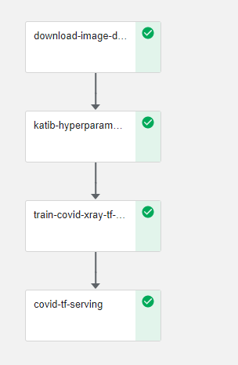

## <a name='InfrastructureUsed'></a>**Infrastructure Used**

* Cisco UCS - C240M5 and C480ML

## <a name='Prerequisites'></a>**Prerequisites**

* UCS machine with [Kubeflow](https://www.kubeflow.org/) 1.0 installed

## <a name='UCSSetup'></a>**UCS Setup**

### <a name='InstallKubeflow'></a>**Install Kubeflow**

To install Kubeflow, follow the instructions from [here](../../../../../../install)

### <a name='InstallNFS'></a>**Install NFS server (if not installed)**

To install NFS server follow steps below.

#### <a name='RetrieveIngressIP'></a>***Retrieve Ingress IP***

For installation, we need to know the external IP of the 'istio-ingressgateway' service. This can be retrieved by the following steps.  

```
kubectl get service -n istio-system istio-ingressgateway
```

If your service is of LoadBalancer Type, use the 'EXTERNAL-IP' of this service.  

Or else, if your service is of NodePort Type - run the following command:  

```
kubectl get nodes -o wide
```

Use either of 'EXTERNAL-IP' or 'INTERNAL-IP' of any of the nodes based on which IP is accessible in your network.  

This IP will be referred to as INGRESS_IP from here on.

#### <a name='InstallNFSserverPV'></a>***Install NFS server, PVs and PVCs***

Follow the [steps](./../../../../../networking/ble-localization/onprem/install) to install NFS server, PVs and PVCs.

## <a name='Notebook'></a>**Chest X-ray Pipeline Notebook**
### <a name='CreateJupyterNotebookServer'></a>**Create Jupyter notebook server**

Follow the [steps](https://github.com/CiscoAI/cisco-kubeflow-starter-pack/tree/master/apps/networking/ble-localization/onprem/notebook#create--connect-to-jupyter-notebook-server) to create & connect to Jupyter Notebook Server in Kubeflow


### <a name='UploadPipelinenb'></a>**Upload Jupyter notebook for chest X-ray pipeline deployment**

Upload chest-xray-pipeline-deployment.ipynb file from [here](./chest-xray-pipeline-deployment.ipynb)

### <a name='RunPipeline'></a>**Run pipeline**

Open the above uploaded notebook and start executing cells - *git clone, load components, define pipeline* 

O/p screenshots of which are captured below.


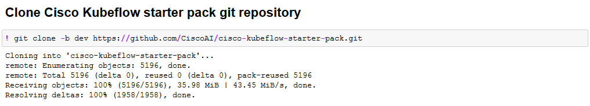


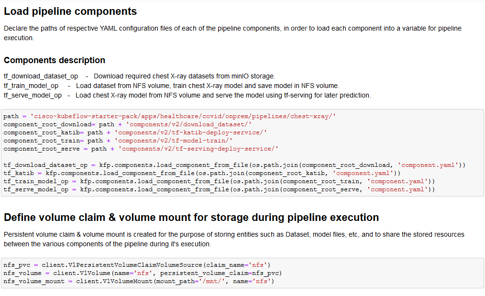


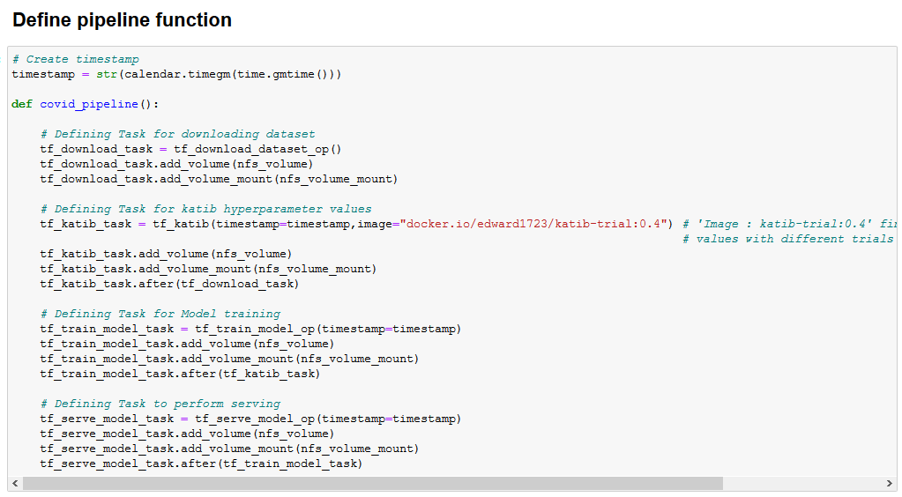

Once the above cells are executed, Experiment and Run link will be generated and displayed as output.
If you click Run link, you will be directed to Kubeflow Pipeline Dashboard

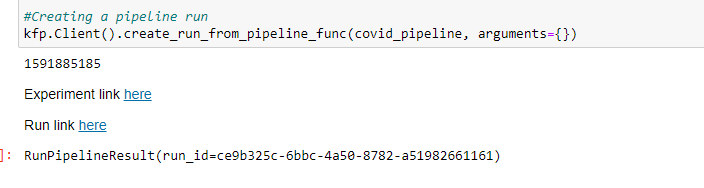

### <a name='PipelineDashboard'></a>**KF Pipeline dashboard**

This dashboard lets you navigate through experiments & runs.

Click on latest run which is created

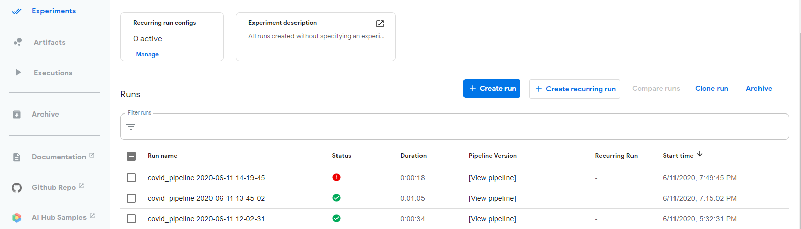

Each pipeline components logs can be viewed as below

Logs of chest X-ray Katib hyperparameter component
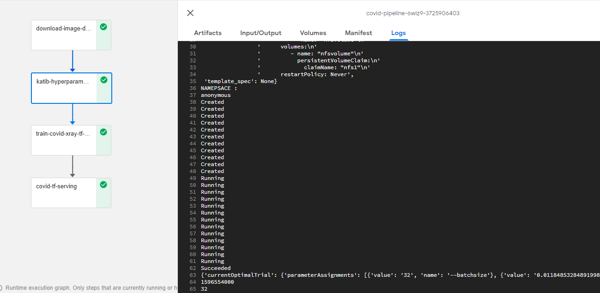

Logs of chest X-ray training component
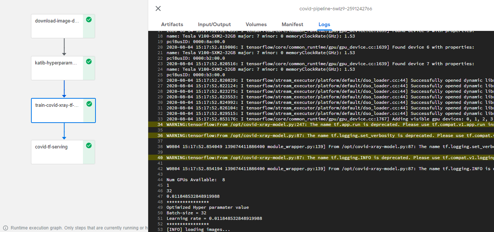

Logs of chest X-ray serving component

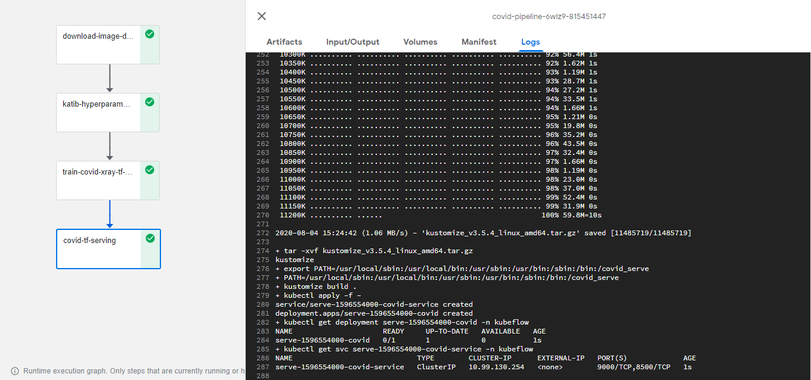

### <a name='KatibDashboard'></a>**Katib dashboard**

To track HP tuning created by pipeline, you need to go Katib dashboard from KF Central dashboard's left panel. 

Screenshots of Katib monitor dashboard & Hyperparameter(HP) tuning results are shown below.

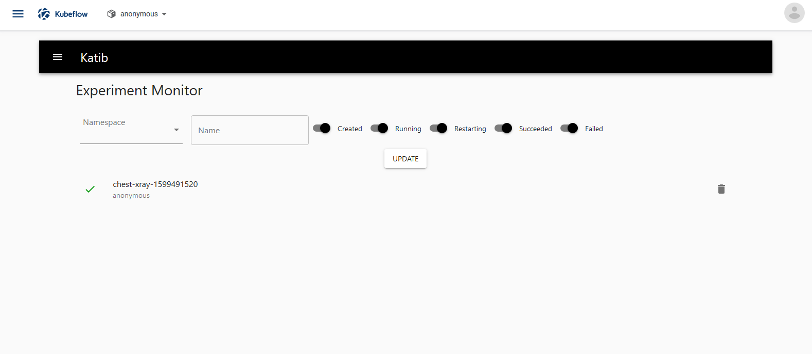
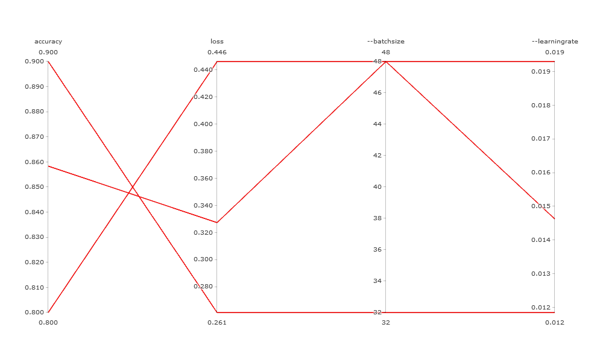
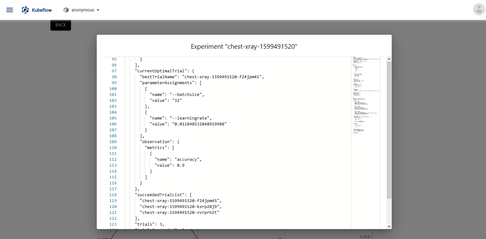

### <a name='Inferencing'></a>**Model inference from notebook**

An inference service is created during the serving component execution of the pipeline. Note that inference service will become ready only after the pipeline completes.

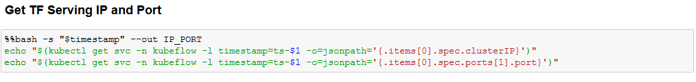

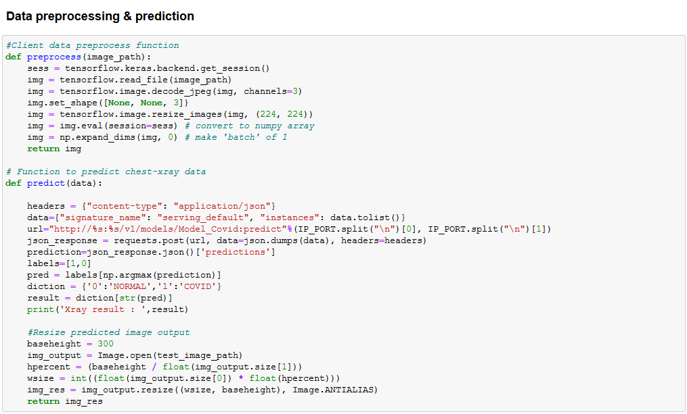

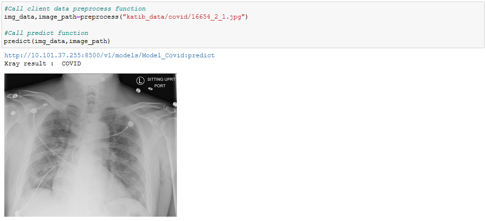


## **Note**:

### How to gather dataset from various sources before pipeline execution

To download & generate image dataset from various sources and store it in Kubeflow minIO object storage (from which datasets are downloaded during pipeline execution), upload dataset-builder-minio-store.ipynb file from [here](./dataset-builder-minio-store.ipynb) to your working directory and execute the notebook only once.

### Visualizations

To add any custom visualization to a pipeline component, please refer [here](./Visualization.md)
