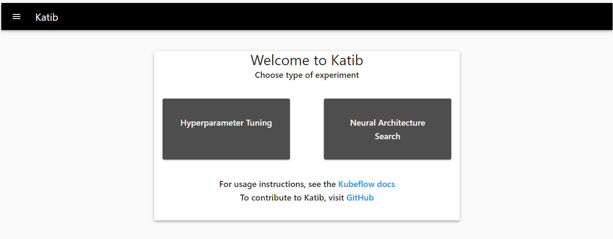
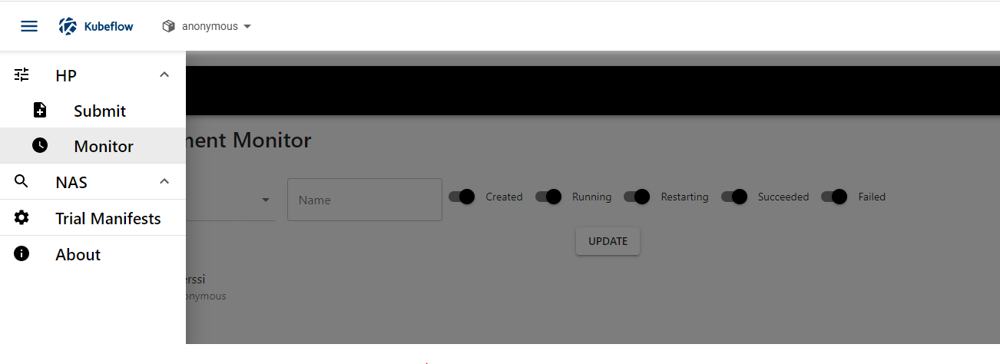
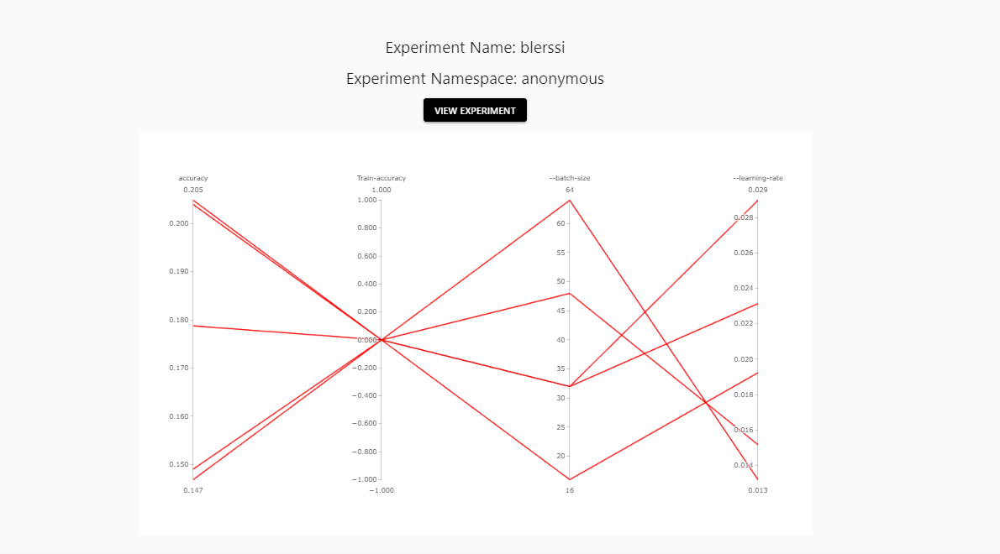

## Accessing the Katib UI

* You can access Kubeflow Dashboard using the Ingress IP, provided while running [nfs-installation](./../install#-provide-ucs-cluster-ip) script, and _31380_ port. For example, http://<INGRESS_IP:31380>

* Select _anonymous_ namespace and click Katib in the left panel of the Kubeflow Dashboard

* You can use the Katib user interface (UI) to submit experiments and to monitor your results. The Katib home page within Kubeflow looks like

* Click Hyperparameter Tuning on the Katib home page.

* Open the Katib menu panel on the left, then open the **HP** section and click **Monitor**

* Click on the right-hand panel to close the menu panel. You should see the list of experiments

* Click the name of the experiment, **blerssi**

* You should see a graph showing the level of accuracy for various combinations of the hyperparameter values (learning rate, batch size)

* Below the graph is a list of trials that ran within the experiment

