# Monitoring

<!-- vscode-markdown-toc -->
* [What we're going to build](#Whatweregoingtobuild)
    * [Infrastructure Used](#InfrastructureUsed)
* [Prerequisites](#Prerequisites)
* [UCS Setup](#UCSSetup)
    * [Retrieve Ingress IP](#RetrieveIngressIP)
* [Notebook Workflow](#NotebookWorkflow)
    * [Create Jupyter Notebook Server](#CreateJupyterNotebookServer)
    * [Upload Notebook](#UploadNotebook)
    * [Run Notebook](#RunNotebook)
* [Accessing Metrics](#AccessingMetrics)
    * [Prometheus](#Prometheus)
    * [Grafana](#Grafana)
* [CleanUp](#CleanUp)

<!-- vscode-markdown-toc-config
        numbering=false
        autoSave=true
        /vscode-markdown-toc-config -->
<!-- /vscode-markdown-toc -->

## <a name='Whatweregoingtobuild'></a>What we're going to build

Train & save a BLERSSI location model from Kubeflow Jupyter notebook. Then, serve and predict using the saved model and push model i/p and o/p metrics into prometheus

### <a name='InfrastructureUsed'></a>Infrastructure Used

* Cisco UCS - C240

## <a name='Prerequisites'></a>Prerequisites

- [ ] Kubernetes Cluster(GKE, UCS) with Kubeflow 1.0 installed

## <a name='UCSSetup'></a>UCS Setup

To install Kubeflow, follow the instructions [here](../../../../../install)

### <a name='RetrieveIngressIP'></a>Retrieve Ingress IP

For installation, we need to know the external IP of the 'istio-ingressgateway' service. This can be retrieved by the following steps.

```
kubectl get service -n istio-system istio-ingressgateway
```

If your service is of LoadBalancer Type, use the 'EXTERNAL-IP' of this service.

Or else, if your service is of NodePort Type - run the following command:

```
kubectl get nodes -o wide
```

Use either of 'EXTERNAL-IP' or 'INTERNAL-IP' of any of the nodes based on which IP is accessible in your network.

This IP will be referred to as INGRESS_IP from here on.

## <a name='NotebookWorkflow'></a>Notebook Workflow
Once the setup is complete, the following are the steps in the Notebook
workflow.

### <a name='CreateJupyterNotebookServer'></a>Create Jupyter Notebook Server

Follow the [steps](./../notebook#create--connect-to-jupyter-notebook-server) to create & connect to Jupyter Notebook Server in Kubeflow

### <a name='UploadNotebook'></a>Upload Notebook

Upload [monitoring.ipynb](monitoring.ipynb) file to the created Notebook server.

### <a name='RunNotebook'></a>Run Notebook

Open the [monitoring.ipynb](monitoring.ipynb) file and run Notebook

Clone git repo


Install required libraries

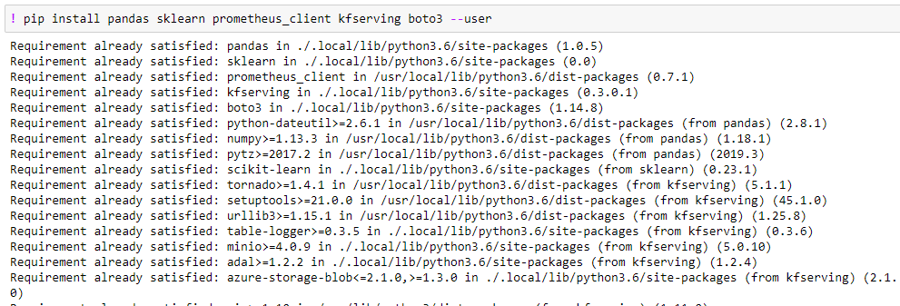

Restart kernel


Import libraries

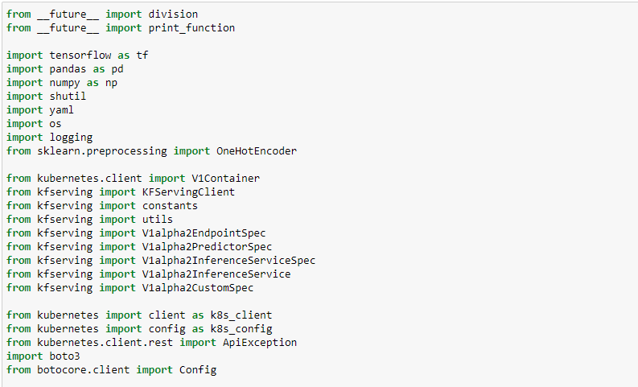

Install Prometheus and Grafana

```
kubectl create namespace knative-monitoring
kubectl apply --filename https://github.com/knative/serving/releases/download/v0.15.0/monitoring-metrics-prometheus.yaml
```
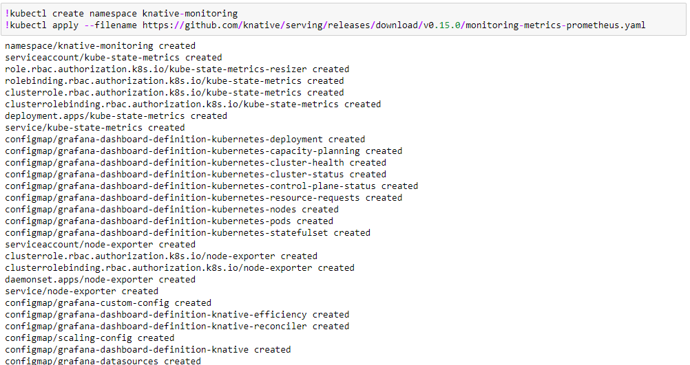

Deploy the Prometheus Pushgateway


Declare Variables

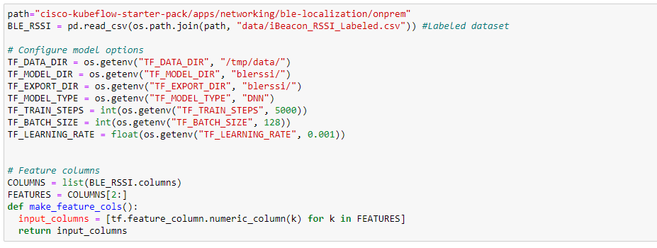

Definition of Serving Input Receiver Function


Train BLERSSI model

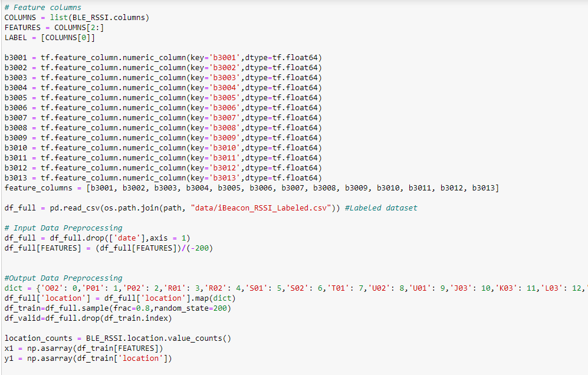

Once training completes, the model will be stored in local notebook server

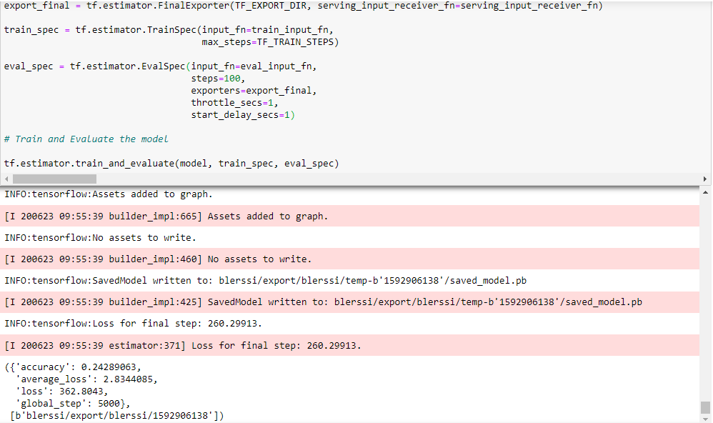

Get Prometheus Pushgateway cluster IP to push metrics


To add your [metrics](./model-server/model.py#L115), [build](./model-server/Dockerfile) the docker image and push into your Docker Hub. It will be used when creating the InferenceService

Inference Logger

Create a message dumper knative service to print out CloudEvents it receives


Create the InferenceService using KFServing client SDK

Replace docker image with your docker image


Define InferenceService

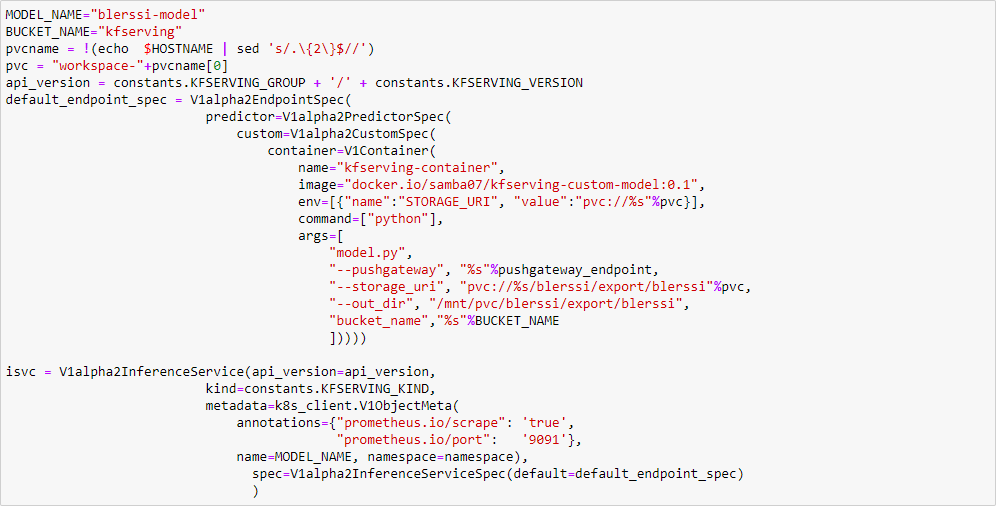

Create the InferenceService

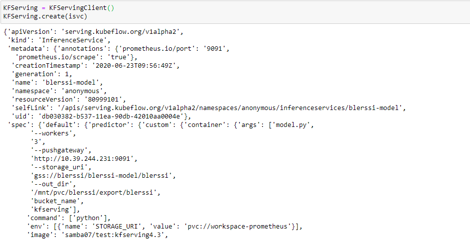

Predict location for test data using served BLERSSI Model


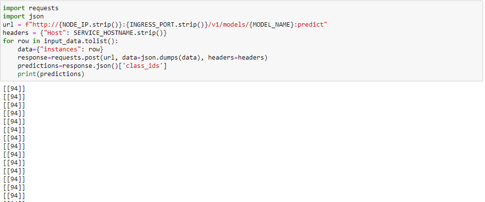

Check the logs of the message dumper

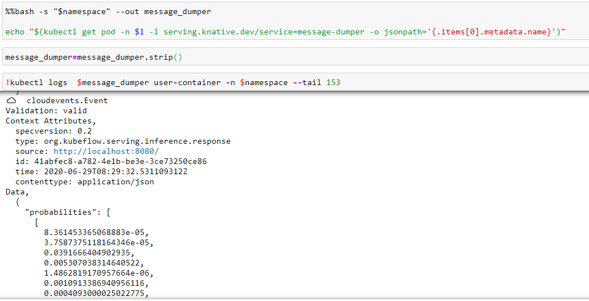

## <a name='AccessingMetrics'></a>Accessing Metrics

### <a name='Prometheus'></a>Prometheus

* To open Prometheus, enter the following command

```
kubectl port-forward -n knative-monitoring \
$(kubectl get pods -n knative-monitoring \
--selector=app=prometheus --output=jsonpath="{.items[0].metadata.name}") \
9090
```
* This starts a local proxy of Prometheus on port 9090. For security reasons, the Prometheus UI is exposed only within the cluster.

* Navigate to the Prometheus UI at http://localhost:9090


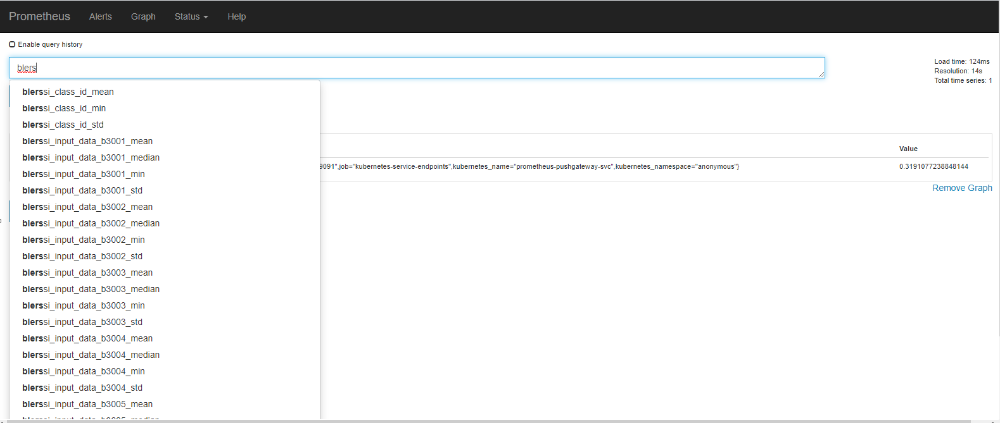


### <a name='Grafana'></a>Grafana

* To open Grafana, enter the following command
```
kubectl port-forward --namespace knative-monitoring \
$(kubectl get pods --namespace knative-monitoring \
--selector=app=grafana --output=jsonpath="{.items..metadata.name}") \
3000
```
* This starts a local proxy of Grafana on port 3000. For security reasons, the Grafana UI is exposed only within the cluster.
* Navigate to the Grafana UI at http://localhost:3000
* Select the Home button on the top of the page to see the list of pre-installed dashboards


* Select knative Serving-Scaling Debugging

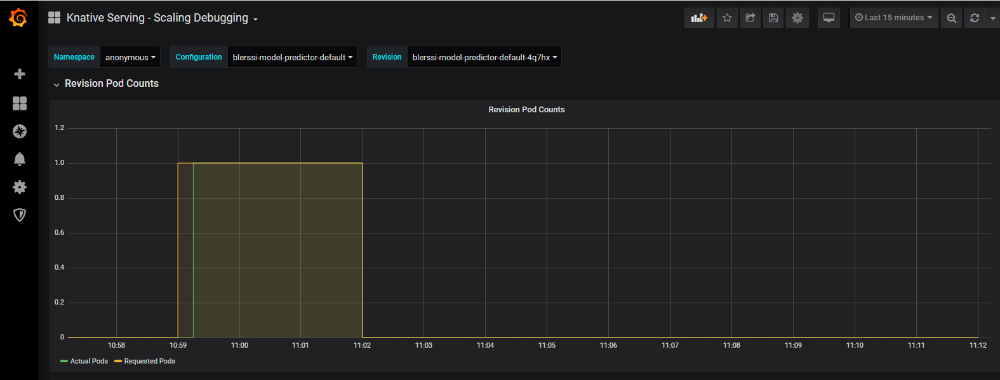


* Resource Usages


### <a name='CleanUp'></a>Clean Up

Delete the InferenceService


Delete the Prometheus pushgateway deployment and service

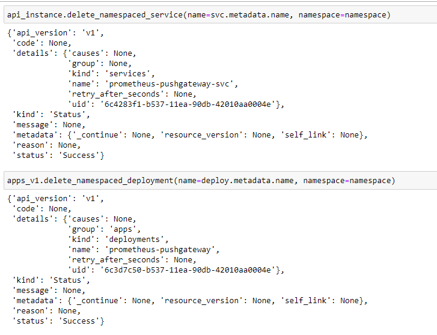

Uninstall Prometheus and Grafana

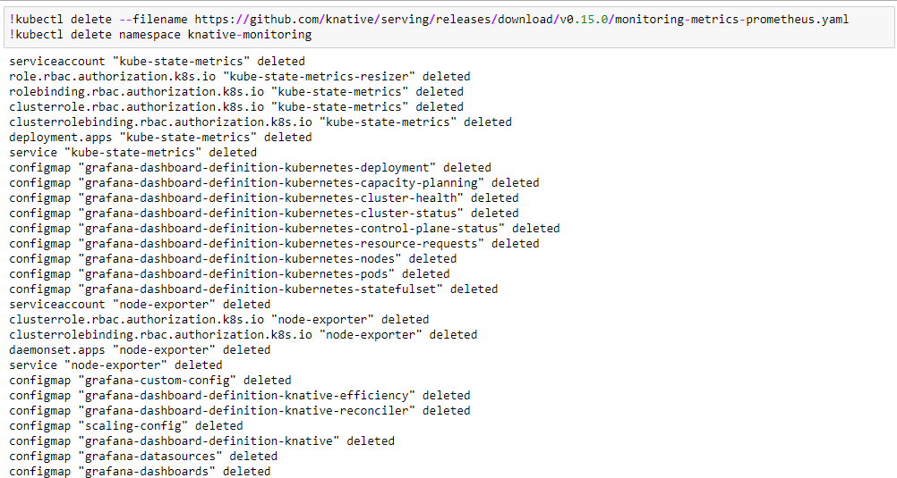

Delete Minio Bucket

